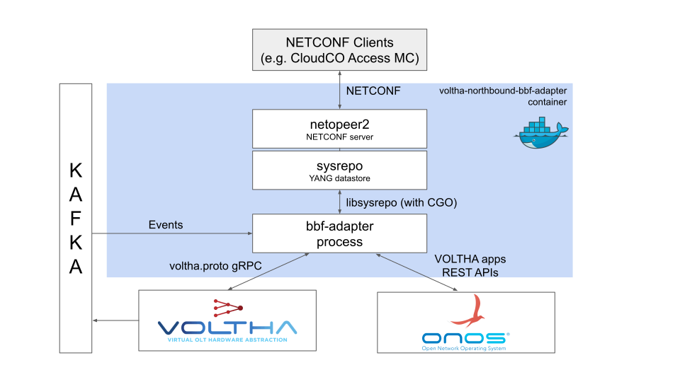

The goal of the voltha-northbound-bbf-adapter is to enable VOLTHA to be controlled through NETCONF using standard BBF yang modules. The current state of the translation between the two mainly consists in the use of the models from [TR-383](https://wiki.broadband-forum.org/display/BBF/TR-383%3A+Common+YANG+Modules+for+Access+Networks).\
The architecture used by the adapter to achieve this involves the use of netopeer2 as a NETCONF server and sysrepo as its datastore. This configuration was proposed by BISDN, more information can be found in the [slides](https://wiki.broadband-forum.org/display/BBF/ONF+and+BBF+SEBA+Collaboration?preview=/131466119/141855024/20220309%20-%20vOLTHA%20adaption%20to%20BBF%20yang%20models.pptx).

On its northbound, the BBF adapter interacts with sysrepo by acting as a plugin, using the APIs of libsysrepo.
Instead, on its southbound, it interacts with VOLTHA's northbound APIs and the Olt ONOS app REST APIs to collect data and perform commands.

# Additional documentation

- [Deployment](deploy.md)
- [Code structure](code_structure.md)
- [Expanding functionality](expanding.md)
- [Output examples](output_examples.md)